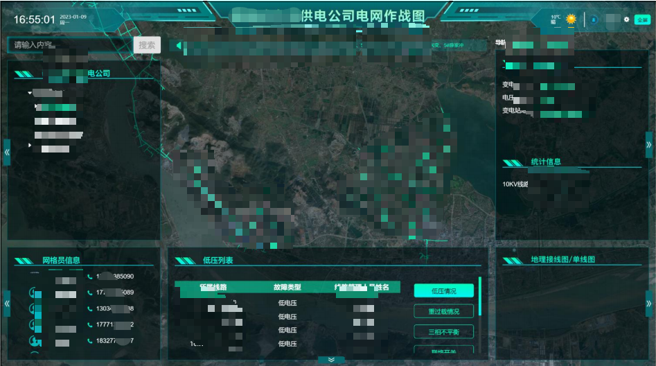

# GIS电网数据一张图数据大屏看板

#### 介绍
GIS电网数据一张图数据大屏看板

定制化开发系统
WeChat：2609375767

#### 软件架构
软件架构说明
vue、mapbox-gl、springboot、mybatis-Plus、redis、postgresql、apacheftp

#### 安装教程

1.  前端npm install
2.  后台导入到IntelliJ IDEA

#### 使用说明

1.  前端npm run serve

                                       

#### 特技

要分为线路树管理、网格员信息、低压情况、重过载情况、三相不平衡、联络开关、故障点信息、交跨点信息、高故障线路、地理接线图/单线图等多个模块，直观展示了电路信息的分布，可快速定位到户表线路等信息。后台数据管理系统主要是实现以上信息的录入导入等功能

